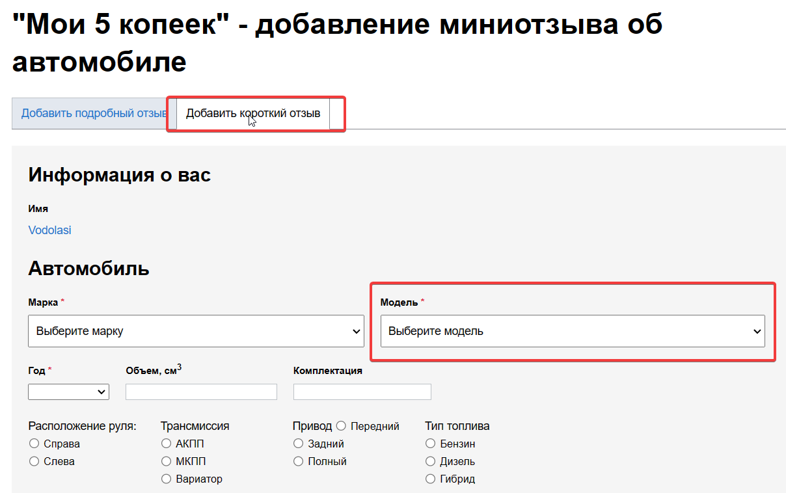
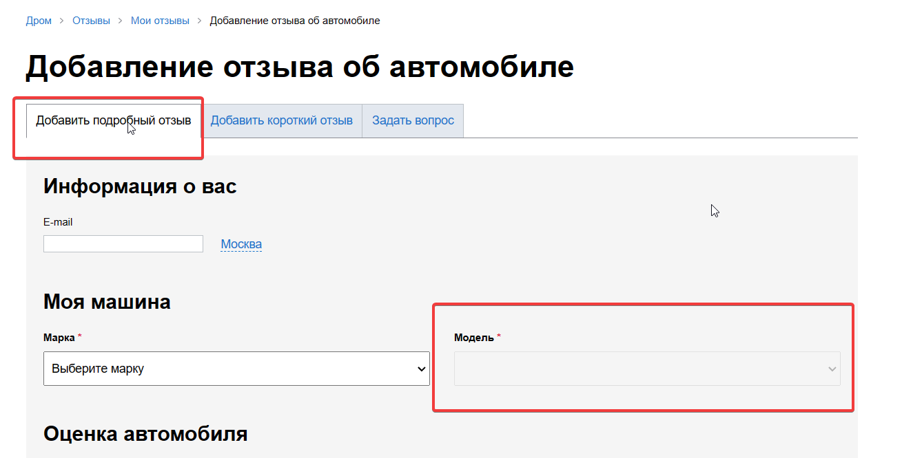

# PROD 'reviews' не корректное отображение элемента

## шаги:

1. перейти (https://www.drom.ru/reviews/add_5kopeek/)
1. Заметить что поле для выбора модели авто горит белым цветом

__Ожидаемый результат :__ Поле серого цвета.

__Фактический результат :__ Поле белого цвета с надписью выберите модель  

__Комментарий :__ В прочих элементах встречающихся на сейте есть закономерность,
что поле модель становится активным после выбора марки авто.

_Время :_ 17:30 08.03.2022  
_Приоритет :_ незначительный    
_Окружение :_ Microsoft Edge
Версия 110.0.1587.63 (Официальная сборка) (64-разрядная версия) 

     

