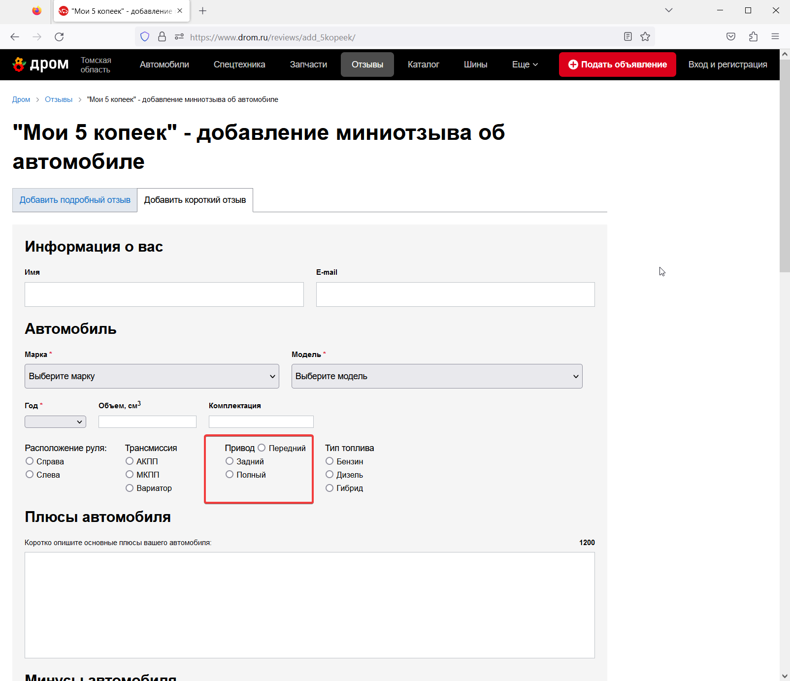

# PROD 'revievs' некорректное отображение элемента

## шаги:

1. перейти (https://www.drom.ru/reviews/add_5kopeek/)

__Ожидаемый результат :__ Верстка отображена корректно.

__Фактический результат :__ Элемент в блоке "Привод" не на месте.

__Комментарий :__ В прочих элементах встречающихся на сейте есть закономерность,
что поле модель становится активным после выбора марки авто.

_Время :_ 17:45 08.03.2022      
_Приоритет :_ незначительный   
_Окружение :_ Firefox 110.0.1 (64-разрядный)

     

