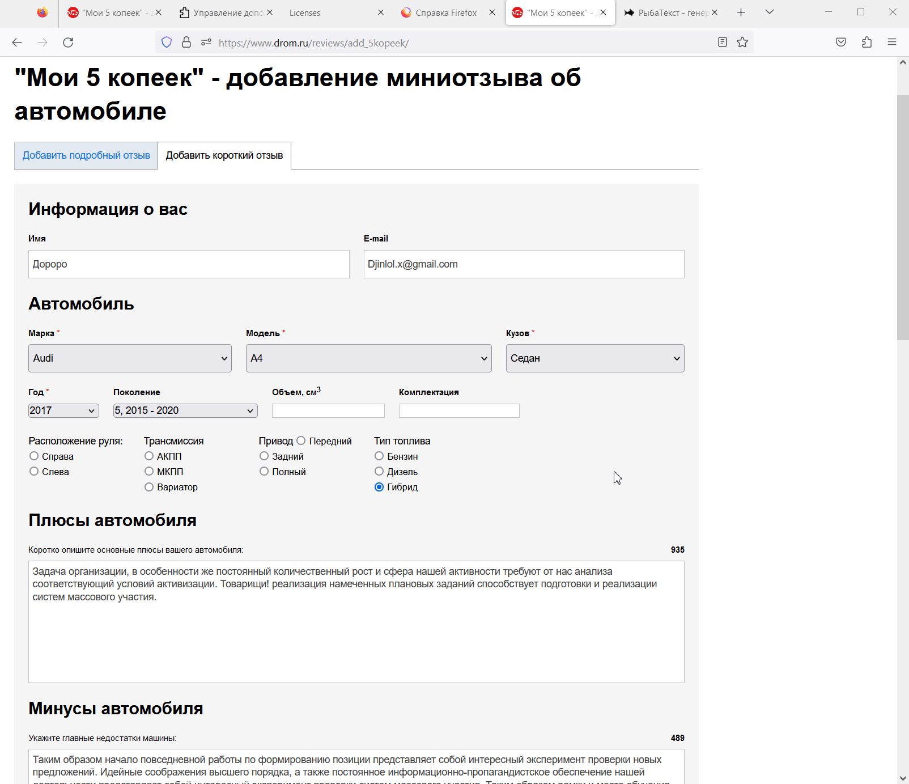

# PROD 'revievs' Некорректное поведение элементов на форме заполнения 

## шаги:

1. перейти (https://www.drom.ru/reviews/add_5kopeek/)
2. Заполнить поля валидными значениями
3. Марка >> Audi ; Модель >> A4 ; Кузов >> Седан ; год >> 2017
4. Заметить, появился элемент "Поколение"
5. Выбрать из списка "правый руль (Япония)"

__Ожидаемый результат :__ В блоке "расположение руля", либо выставлен  соответствующий тумблер, либо блок стал не активен.

__Фактический результат :__ Блок активен. После любого взаимодействия с ним пропадает элемент "Поколение".

__Комментарий :__ Есть наблюдение, блок "Поколение" не пропадает если в выпадающем списке более двух записей.
Когда например есть версия с **(левым или правым)** рулем в рестайлинг и без.

_Время :_ 19:30 08.03.2022    
_Приоритет :_ средний (может сказаться на работе поисковика)   
_Окружение :_ Firefox 110.0.1 (64-разрядный)

     
